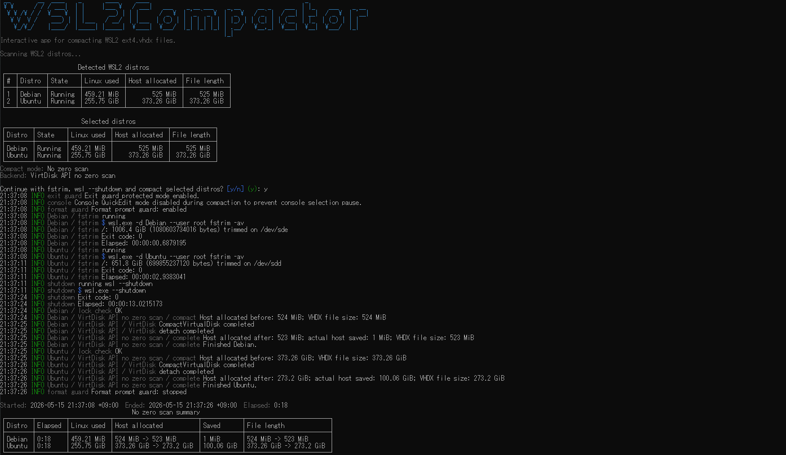

# WSL2Compactor

WSL2Compactor is an interactive Windows console application for compacting WSL2 `ext4.vhdx` files.

It guides the WSL and Windows compaction steps in order.



## Download

Download `WSL2Compactor-win-x64.exe` from the [latest GitHub Release](https://github.com/rnlcrosoft/WSL2Compactor/releases/latest) and run it as Administrator.

## How It Works

- Finds WSL2 distributions with an existing `ext4.vhdx`.
- Shows Linux filesystem usage, Windows host allocation, and VHDX file length.
- Runs `fstrim` inside selected distros.
- Runs `wsl.exe --shutdown` so Windows can compact the VHDX file.
- Compacts with the Windows `VirtDisk API`.

The app offers two compact modes:

- `No zero scan`: uses `COMPACT_VIRTUAL_DISK_FLAG_NO_ZERO_SCAN`.
- `Zero scan`: calls `CompactVirtualDisk` without that flag.

## Displayed Values

| Column | Meaning |
| --- | --- |
| `Linux used` | `df`-style filesystem space used inside the distro. |
| `Ext4 overhead` | Exact ext4 structural overhead when available; otherwise `-`. |
| `Linux footprint` | `Linux used + Ext4 overhead`, shown only when both values are available. |
| `Host allocated` | Windows host disk space allocated by `ext4.vhdx`, read with `GetCompressedFileSizeW`. |
| `File length` | Logical Windows file length of `ext4.vhdx`. |
| `Saved` | Actual host allocation delta after compaction: `max(0, host allocated before - host allocated after)`. |

The app does not show a pre-run savings estimate because that cannot be computed from `Linux used`, `Host allocated`, and `File length` alone.

## Build

Requirements:

- .NET 10 SDK
- Windows 10/11 x64 target

The app is a Windows x64 executable. End users should download the self-contained executable from Releases; building from source requires the .NET 10 SDK.

From Windows PowerShell:

```powershell
dotnet build .\WSL2Compactor.slnx -c Release

dotnet publish .\src\WSL2Compactor\WSL2Compactor.csproj `
  -c Release `
  -r win-x64 `
  --self-contained true `
  -p:PublishSingleFile=true `
  -p:EnableCompressionInSingleFile=true `
  -p:PublishTrimmed=true `
  -p:PublishReadyToRun=false `
  -o .\.build\publish
```

The published executable is written to `.build/publish/WSL2Compactor.exe`.

For release checks, run:

```powershell
dotnet build .\WSL2Compactor.slnx -c Release
dotnet format .\WSL2Compactor.slnx --verify-no-changes
```

## License

MIT
